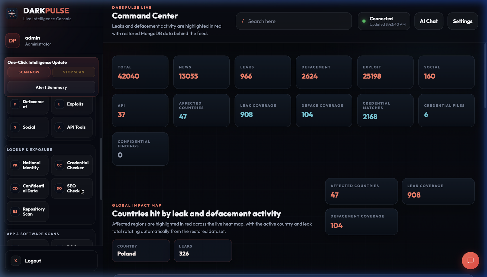
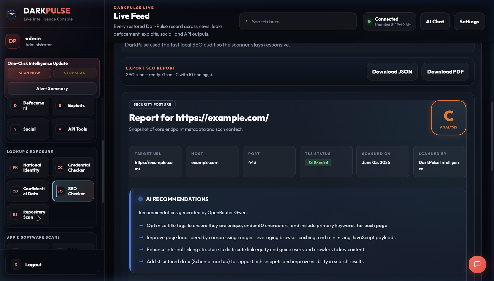
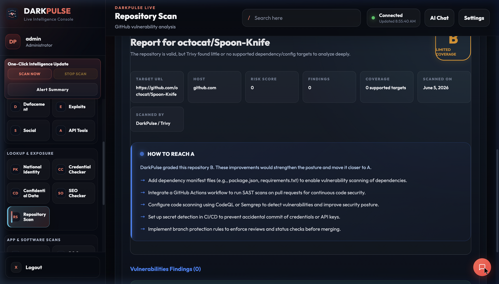
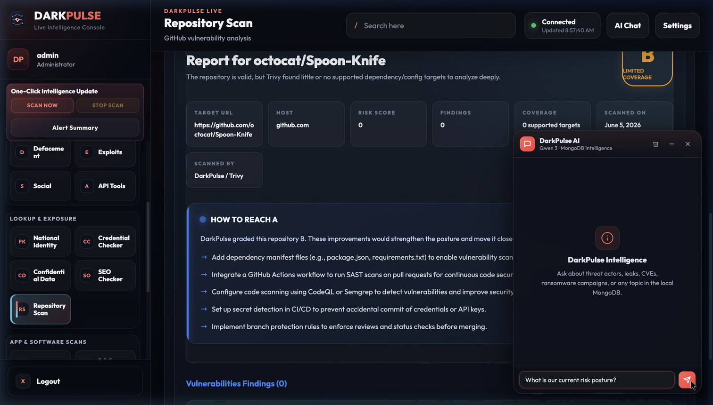

# DarkPulse 2.0: Agentic OSINT Threat Intelligence Engine

DarkPulse is an advanced, fully autonomous Open Source Intelligence (OSINT) and Threat Intelligence engine. It crawls, analyzes, and correlates security data from multiple sources in real-time, providing actionable insights through a centralized dashboard and an interactive AI chatbot.



## Core Capabilities

- **Autonomous Background Agent**: The `agent_manager` utilizes the Scout, Janitor, and Analyst patterns to automatically scrape intelligence, clean it, and evaluate its impact using the **OpenRouter Qwen 3 model**.
- **Real-Time Data Streaming**: Backend API powered by FastAPI utilizing Server-Sent Events (SSE) to push live updates to the UI, ensuring the dashboard never goes stale.
- **Persistent AI Chatbot**: An always-available, floating, glassmorphic chatbot leveraging RAG (Retrieval-Augmented Generation) against the local MongoDB instance. Get summaries, extract indicators of compromise, and analyze threats via natural language.
- **Modular Intelligence Collectors**: Dedicated scrapers for News, GitHub Repositories, APK Files, SEO Metadata, and Defacement feeds.

## Embedded Scanners

DarkPulse ships with specialized scanners that allow security analysts to actively probe domains, IP addresses, and repositories directly from the UI.

### SEO & Web Metadata Scanner
Extract vital metadata, response headers, and core web vitals from any given URL. Useful for identifying anomalous domains or infrastructure changes associated with threat actors.



### GitHub Repository Scanner
Powered by Trivy integration, analyze any GitHub repository for misconfigurations, leaked secrets, and known vulnerabilities within its dependencies. 



## AI-Powered Analyst (Chatbot)

DarkPulse features an advanced chatbot powered by **Qwen 3 (235B)** (via OpenRouter) that can rapidly sift through the local intelligence database to answer complex queries. 



### How it works:
- **Optimized Text Search**: Automatically strips conversational stop-words from queries to accurately rank relevance in MongoDB.
- **Streaming Responses**: Answers stream directly to the UI, providing near-instant feedback with a time-to-first-token of just 2-3 seconds.
- **Source Referencing**: Every fact provided by the AI is backed by actionable, clickable references linked directly to the crawled intelligence records.

## Installation

### Prerequisites
- Python 3.11+
- MongoDB instance (local or remote)
- OpenRouter API Key (for Qwen 3 AI summaries and chatbot)

### Setup

1. **Clone the repository:**
   ```bash
   git clone https://github.com/alynaeem/fyp.git
   cd fyp
   ```

2. **Install Dependencies:**
   ```bash
   pip install -r requirements.txt
   ```

3. **Configure Environment:**
   Copy `.env.example` to `.env` and populate your API keys:
   ```env
   MONGO_URI=mongodb://127.0.0.1:27017
   OPENROUTER_API_KEY=your_key_here
   ```

4. **Start the Application:**
   Run the backend API/UI Server:
   ```bash
   python3 -m uvicorn ui_server:app --host 0.0.0.0 --port 8000
   ```
   
   In a separate terminal, start the background intelligence agent:
   ```bash
   python3 agent_manager.py
   ```

5. **Access the Dashboard:**
   Navigate to `http://localhost:8000` and login.

## Architecture
The application has recently undergone a major architectural refactor, transitioning from a monolithic script structure to an ES-module based modular frontend, with a streaming Python/FastAPI backend utilizing `motor` for fully asynchronous MongoDB operations.
